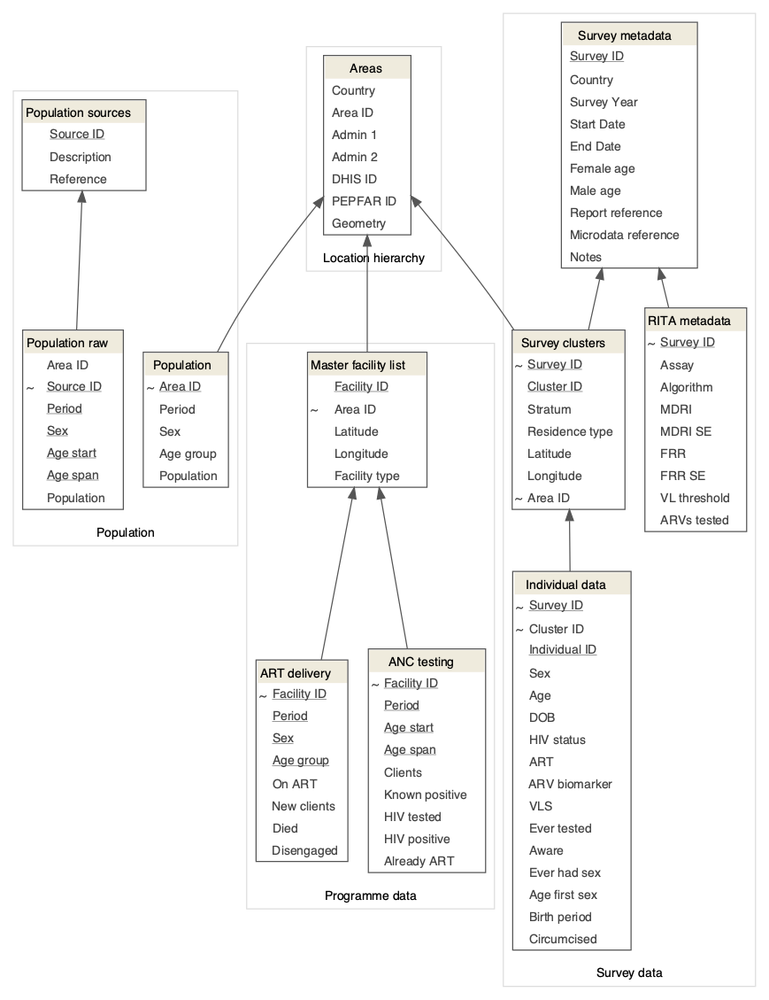

<!-- README.md is generated from README.Rmd. Please edit that file -->

```{r setup, include = FALSE}
knitr::opts_chunk$set(
  collapse = TRUE,
  comment = "#>"
)
```
# naomi-dev

Development version of model for joint small-area estimation of HIV prevalence, ART coverage, and HIV incidence, provisionally named *Naomi*.

## Data

The relational diagramme below summarises the data elements required for model inputs.

<p align="center"> 

</p>

The directory `data-raw` contains scripts for preparing data inputs from primary data sources. Following the relational model, data inputs are recommended to be prepared in the following order:

* `data-raw/shapefile/`: creates the location hierarchy and area boundaries.
* `data-raw/population/`: creates population by area, sex, and age group, and aggregated population (15-49, 15-64, 15+).
* `data-raw/survey/`: analyses household survey data for area-level survey estimates of prevalence, ART coverage, viral load suppression, and recent HIV infection.
* `data-raw/programme/`: creates datasets for for number receiving ART and routine antenatal HIV testing (ANC-RT).

_District-level data for MPHIA 2015-16 are **simulated** for illustrative purposes by randomly allocating survey clusters within each stratum to districts proportionally to population size. See script `data-raw/surveys/surveys.R` for simulated district allocation._

The directory `data` contains processed data inputs:

* `data/shapefile.rda`: shapefile for area boundaries and hierarchy.
* `data/population.rda`: two datasets _pop_agesex_ for population stratified by area, sex, and 5-year age-group, and _pop_aggr_ with area-level aggregate population.
* `data/survey.rda`: survey estimates for HIV prevalence, ART coverage, VLS, and recent infection at all levels of location hierarchy and various age/sex stratifications.
* `data/programme.rda`: aggregated area-level data for ART and ANC-RT by quarter.

## Load inputs

#### Load packages

```{r, message = FALSE}
library(tidyverse)
library(here)
library(sf)
library(rstan)
```

#### Load functions

```{r}
source(here("R/car.R"))
source(here("R/art-attendance.R"))
```

#### Load data

```{r load data}
load(here("data/shapefile.rda"))
load(here("data/population.rda"))
load(here("data/survey.rda"))
load(here("data/programme.rda"))
```

## Prepare model inputs

#### Define areas, population, and number on ART

The first step assembles a master array defining the areas, population size, and number on ART:

1. Start with a shapefile for the areas (as an `sf` object).
1. Merge the population age 15-49, 15-64, and 15+ for April 2016 (approximately the midpoint of the PHIA survey fieldwork).
1. Merge the number of adults 15+ on ART in each district at the end of Q1 2016.
1. Define a sequential index (`idx`) for each area, which will be used for indexing other datasets. 

```{r}

mw <- sh32 %>%
  left_join(
    pop_aggr %>%
    filter(year == 2016.25) %>%
    select(area_id,
           pop15pl = pop15pl_cens18adj,
           pop15to49 = pop15to49_cens18adj,
           pop15to64 = pop15to64_cens18adj)
  ) %>%
  left_join(
    artdat %>%
    filter(quarter == "2016 Q1") %>%
    select(area_id, art15pl = art15pl_cleaned)
  ) %>%
  left_join(
    ancrt %>% 
    filter(year == 2016, data_used == "used") %>%
    group_by(district32) %>%
    summarise_at(vars(ancrt_n, ancrt_pos, ancrt_art), sum) %>%
    ungroup %>%
    mutate(ancrt_neg = ancrt_n - ancrt_pos,
           ancrt_noart = ancrt_pos - ancrt_art,
           ancrt_prev = ancrt_pos / ancrt_n,
           ancrt_artcov = ancrt_art / ancrt_pos)
  )

  arrange(district_code32) %>%
  mutate(district32 = fct_reorder(district32, district_code32),
         idx = row_number())

```

#### Define adjacency structure for ART attendance model

```{r}
M <- create_adj_matrix(mw)
diag(M) <- 1L

adj_ij <- create_attend_ij(M)
d_adj_ij <- create_attend_d_ij(adj_ij)

sd <- list(N_reg        = nrow(mw),
           district     = mw$district32,
           district_idx = mw$idx,
           pop15pl_i    = mw$pop15pl,
           pop15to49_i  = mw$pop15to49,
           art15pl_i    = mw$art15pl,
           prev_ratio   = 1.0,
           ##
           N_adj        = nrow(adj_ij),
           n_nb         = table(adj_ij$j) - 1L,
           adj_i        = adj_ij$i,
           adj_j        = adj_ij$j,
           adj_idx_ij   = adj_ij$idx_ij,
           adj_idx_ji   = adj_ij$idx_ji,
           

  n

```

## Fit model

#### Compile Stan model

`r
sm <
